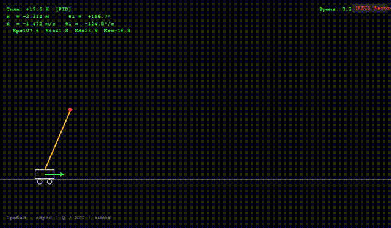

# RL — Reinforcement Learning Controllers

Краткое описание

Проект служит демонстрационной платформой для исследования и сравнения методов управления и обучения с подкреплением. Цель — предоставить простую и понятную среду для визуализации поведения контроллеров и оценки их качества.

Задачи проекта

- Предоставить симуляции управляемых систем для проведения экспериментов.
- Обеспечить возможность визуализации и записи поведения контроллеров.
- Создать удобную основу для обучения и тестирования новых алгоритмов управления.

Демонстрация

Ниже встроена анимация, демонстрирующая работу симуляции и контроллера:

Использование в публичном репозитории
