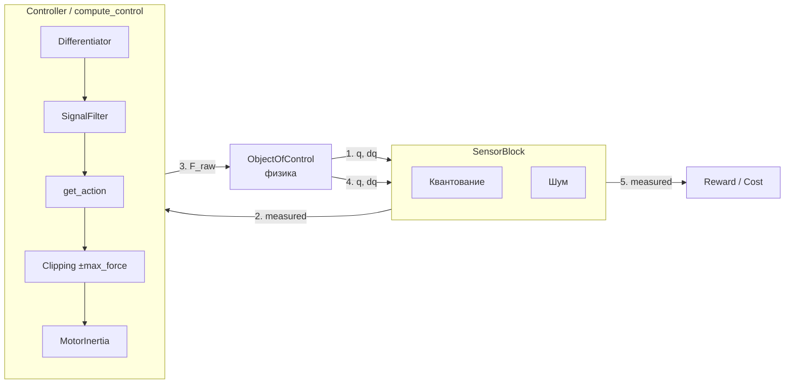

# CO — Control Object (Inverted Pendulum)

Пакет для математического моделирования перевёрнутого маятника на тележке
(cart–pole system). Реализует симуляцию физики, датчиков, регуляторов
и тактов управления.

---

## 1. Обзор

**CO** предоставляет:

- **Физическую модель** тележки с одно- или двухзвенным маятником
  (интегрирование RK4, опционально — C++ backend через pybind11)
- **Блок датчиков** с квантованием энкодеров и предвычисленным белым шумом
- **Шаблон контроллера** (Template Method) с конвейером:
  дифференцирование → фильтрация → закон управления → клиппинг → инерция
- **Тактовый движок** (`clock_cycle`) с имитацией вычислительной задержки
- **Набор конфигураций** (PlantConfig, SensorConfig, ControllerConfig)

Пакет используется как основа для обучения RL-агентов (REINFORCE, DDPG)
и классических регуляторов (PID).

---

## 2. Установка

```bash
poetry install
```

### Сборка C++ модуля (опционально, для производительности)

```bash
cd packages/simulation/CO/cpp
mkdir build && cd build
cmake .. -DPYBIND11_ROOT=$(poetry env info -p)/lib/python3.12/site-packages/pybind11
make
cp co_cpp*.so ..
```

Без C++ модуля `ObjectOfControl.update_physics()` вызовет `RuntimeError`.

---

## 3. Архитектура

### 3.1. Общая схема



### 3.2. Поток данных за один control-tick (`clock_cycle`)

```
Вход: old_F, target_state
  │
  ├─ 1. Заморозка (20–50% такта): физика с предыдущей силой
  │
  ├─ 2. Телеметрия: SensorBlock.get_telemetry(q, dq)
  │
  ├─ 3. compute_control(measured, target):
  │      ├─ Differentiator → скорости (если нет датчиков скоростей)
  │      ├─ SignalFilter   → ФНЧ всего вектора
  │      ├─ get_action()   → закон управления (abstract)
  │      ├─ Clipping       → ±max_force
  │      └─ MotorInertia   → инерционность (опционально)
  │
  ├─ 4. Оставшаяся часть такта: физика с новой силой
  │
  └─ 5. J(target_state, measured) → reward / cost
```

### 3.3. Почему удалены `action_filter` и `action_smooth`

Ранее в `compute_control` присутствовали два последовательных EMA-фильтра:
`action_filter` (до клиппинга) и `action_smooth` (после клиппинга).
Они признаны избыточными при наличии `MotorInertia` — физическая
инерционность двигателя уже является апериодическим звеном первого порядка,
и дополнительные цифровые фильтры только вносят лишнее запаздывание
и усложняют настройку.

---

## 4. Компоненты

### 4.1. [`NoiseForce`](datatypes.py) — внешнее возмущение

Параметры белого шума, добавляемого к управляющей силе.

| Поле | Тип | Значение | Описание |
|---|---|---|---|
| `mean` | `float` | `0.0` | Математическое ожидание возмущения (Н) |
| `std` | `float` | `0.0` | СКО возмущения (Н) |

**Методы:**
- `get_force() → float` — сгенерировать случайную силу по нормальному распределению;
  при `std == 0` возвращает `mean` без вызова RNG.

---

### 4.2. [`PlantConfig`](datatypes.py) — конфигурация объекта управления

| Поле | Тип | По умолч. | Описание |
|---|---|---|---|
| `M` | `float` | `1.0` | Масса тележки (кг) |
| `m1` | `float` | `0.3` | Полная масса первого звена (кг) |
| `m2` | `float` | `0.0` | Полная масса второго звена (кг) |
| `l1` | `float` | `1.0` | Геометрическая длина первого звена (м) |
| `l2` | `float` | `0.0` | Геометрическая длина второго звена (м) |
| `L1` | `float` | `0.7` | Расстояние до ЦМ первого звена (м) |
| `L2` | `float` | `0.0` | Расстояние до ЦМ второго звена (м) |
| `J1` | `float` | `0.02` | Момент инерции первого звена (кг·м²) |
| `J2` | `float` | `0.0` | Момент инерции второго звена (кг·м²) |
| `g` | `float` | `9.81` | Ускорение свободного падения (м/с²) |
| `b_c` | `float` | `0.0` | Коэф. вязкого трения тележки |
| `b_1` | `float` | `0.0` | Коэф. вязкого трения в шарнире θ₁ |
| `b_2` | `float` | `0.0` | Коэф. вязкого трения в шарнире θ₂ |
| `single_pendulum_mode` | `bool` | `True` | Блокировка второй степени свободы |
| `backslash_mode` | `bool` | `False` | Учёт люфта редуктора (TODO) |
| `backlash_alpha` | `float` | `0.0` | Ширина зазора редуктора (м) |
| `backlash_m_mot` | `float` | `0.0` | Приведённая масса ротора (кг) |
| `init_q` | `np.ndarray` | `[0, π, 0]` | Начальные координаты (x, θ₁, θ₂) |
| `init_dq` | `np.ndarray` | `[0, 0, 0]` | Начальные скорости (ẋ, θ̇₁, θ̇₂) |
| `dt` | `float` | `0.0005` | Шаг интегрирования физики (с) |

**Методы:**
- `to_dict() → dict` — сериализация в плоский словарь для `ObjectOfControl.__init__`
- `copy() → PlantConfig` — глубокая копия с независимыми массивами `init_q` / `init_dq`

---

### 4.3. [`SensorConfig`](datatypes.py) — конфигурация датчиков

| Поле | Тип | По умолч. | Описание |
|---|---|---|---|
| `encoder_resolution_1` | `int` | `4096` | Разрядность энкодера θ₁ (имп./оборот) |
| `encoder_resolution_2` | `int` | `4096` | Разрядность энкодера θ₂ |
| `cart_sensor_resolution` | `float` | `0.0001` | Дискретность датчика положения тележки (м) |
| `noise_std_q` | `list[float]` | `(0.001, 0.005, 0.005)` | СКО шума координат (x, θ₁, θ₂) |
| `noise_std_dq` | `list[float]` | `(0.01, 0.02, 0.02)` | СКО шума скоростей |
| `seed` | `int \| None` | `None` | Seed для генератора шума (воспроизводимость) |

**Методы:**
- `to_dict() → dict` — сериализация для `SensorBlock.__init__`

---

### 4.4. [`ControllerConfig`](datatypes.py) — конфигурация регулятора

| Поле | Тип | По умолч. | Описание |
|---|---|---|---|
| `dt` | `float` | `0.005` | Такт управления (с) — 200 Гц |
| `max_force` | `float` | `30.0` | Максимальная сила мотора (Н) |
| `has_velocity_sensors` | `bool` | `False` | Есть ли датчики скоростей |
| `differentiator_cutoff_hz` | `float \| None` | `None` | Частота среза дифференциатора (Гц) |
| `filter_cutoff_hz` | `float` | `50.0` | Частота среза ФНЧ сигнала (Гц) |
| `gains` | `list[float]` | `[10, 1, 2, 1]` | Коэффициенты PID (специфичны для PID) |

**Методы:**
- `to_dict() → dict` — сериализация для `Controller.__init__`

---

### 4.5. [`Differentiator`](controller.py) — численное дифференцирование

Вычисляет скорости по координатам методом конечных разностей назад
(backward difference) с опциональным EMA-сглаживанием для подавления шума.

**Формула:**
$$v_k = \frac{q_k - q_{k-1}}{dt}$$

$$v^{\text{filt}}_k = \alpha \cdot v_k + (1-\alpha) \cdot v^{\text{filt}}_{k-1}$$

$$\alpha = \frac{dt}{\tau + dt}, \quad \tau = \frac{1}{2\pi f_{\text{cut}}}$$

**Параметры `__init__`:**

| Параметр | Тип | Описание |
|---|---|---|
| `dt` | `float` | Период дискретизации (с) |
| `cutoff_hz` | `float \| None` | Частота среза EMA; `None` — без фильтрации |

**Методы:**

| Метод | Возврат | Описание |
|---|---|---|
| `calculate_velocity(positions)` | `np.ndarray` | Вычислить скорости; первый вызов → нули |
| `reset()` | `None` | Сброс истории |

---

### 4.6. [`SignalFilter`](controller.py) — ФНЧ первого порядка

Экспоненциальное сглаживание (EMA) для подавления шума измерений.

**Формула:**

$$y_k = \alpha \cdot u_k + (1-\alpha) \cdot y_{k-1}$$

$$\alpha = \frac{dt}{\	au + dt}, \quad \	au = \frac{1}{2 \pi*f_{\	ext{cut}}}$$

**Параметры `__init__`:**

| Параметр | Тип | Описание |
|---|---|---|
| `cutoff_hz` | `float` | Частота среза (Гц); должна быть > 0 |
| `dt` | `float` | Период дискретизации (с) |

**Методы:**

| Метод | Возврат | Описание |
|---|---|---|
| `filter_signal(measurement)` | `np.ndarray` | Пропустить измерение через ФНЧ |
| `reset()` | `None` | Сброс памяти |

---

### 4.7. [`Controller`](controller.py) — абстрактный контроллер (ABC)

Шаблонный метод `compute_control` задаёт конвейер обработки сигнала,
общий для любого закона управления.

**Сигнатура `__init__`:**
```python
def __init__(self, config: ControllerConfig) -> None
```

**Атрибуты экземпляра:**

| Атрибут | Тип | Доступ | Описание |
|---|---|---|---|
| `name` | `str` | public | Имя закона управления |
| `_dt` | `float` | protected | Такт управления (с) |
| `_max_force` | `float` | protected | Максимальная сила (Н) |
| `_has_velocity_sensors` | `bool` | protected | Наличие датчиков скоростей |
| `_differentiator` | `Differentiator` | protected | Блок дифференцирования |
| `_signal_filter` | `SignalFilter` | protected | Блок ФНЧ |
| `_last_control_action` | `float` | protected | Последняя сила (Н) |
| `_motor_inertia` | `MotorInertia \| None` | protected | Модель инерции |

**Свойства:**

| Свойство | Тип | Описание |
|---|---|---|
| `last_control_action` | `float` | Последняя вычисленная сила (Н) |
| `differentiator` | `Differentiator` | Доступ к блоку дифференцирования |
| `signal_filter` | `SignalFilter` | Доступ к блоку ФНЧ |

**Методы:**

| Метод | Возврат | Описание |
|---|---|---|
| `compute_control(measured_state, target_state)` | `float` | **Template Method**: дифференцирование → ФНЧ → get_action → клиппинг → MotorInertia |
| `get_action(s_clean, target_state)` | `float` | **Абстрактный** — закон управления (реализовать в наследнике) |
| `set_motor_inertia(time_constant)` | `None` | Включить MotorInertia с постоянной τ (с) |
| `reset()` | `None` | Сброс Differentiator, SignalFilter, MotorInertia, last_control_action |

---

### 4.8. [`MotorInertia`](engine.py) — инерционность двигателя

Апериодическое звено первого порядка — единственное физически осмысленное
сглаживание в конвейере управления.

**Передаточная функция:**
$$W(s) = \frac{1}{\tau s + 1}$$

$$F_{k+1} = F_k + (F_{\text{target}} - F_k) \cdot \frac{dt}{\tau}$$

**Параметры `__init__`:**

| Параметр | Тип | Описание |
|---|---|---|
| `time_constant` | `float` | Постоянная времени τ (с). Если ≤ 0 — инерция отключена |

**Свойства:**

| Свойство | Тип | Описание |
|---|---|---|
| `current_force` | `float` | Текущее реальное усилие (Н) |

**Методы:**

| Метод | Возврат | Описание |
|---|---|---|
| `update(target_force, dt)` | `float` | Обновить усилие, вернуть новое реальное (Н) |
| `reset()` | `None` | Обнулить усилие |

---

### 4.9. [`BacklashModel`](pendulum.py) — модель люфта редуктора (TODO)

> [!WARNING]
> **TODO**: Модель может быть удалена. По умолчанию `backslash_mode = False`.

Модель зазора механического редуктора: пока мотор внутри зазора шириной `alpha`,
усилие на тележку не передаётся (`F_real = 0`).

**Параметры `__init__`:**

| Параметр | Тип | Описание |
|---|---|---|
| `alpha` | `float` | Ширина зазора редуктора (м) |
| `m_mot` | `float` | Приведённая масса ротора двигателя (кг) |

**Свойства:**

| Свойство | Тип | Описание |
|---|---|---|
| `alpha` | `float` | Ширина зазора (м) |
| `gap_position` | `float` | Текущее положение внутри зазора `[-α/2, +α/2]` |
| `in_contact` | `bool` | `True`, если зазор выбран (контакт) |

**Методы:**

| Метод | Возврат | Описание |
|---|---|---|
| `update(F_ideal, cart_velocity, dt)` | `float` | Обновить люфт, вернуть `F_real` |
| `reset()` | `None` | Сброс положения внутри зазора |

---

### 4.10. [`ObjectOfControl`](pendulum.py) — физическая модель

Интегрирует уравнения движения тележки с маятником методом RK4
(требует C++ backend).

**Сигнатура `__init__`:**
```python
def __init__(self, config: PlantConfig) -> None
```

**Свойства:**

| Свойство | Тип | Описание |
|---|---|---|
| `q` | `np.ndarray` | Координаты `(x, θ₁, θ₂)` — копия! |
| `dq` | `np.ndarray` | Скорости `(ẋ, θ̇₁, θ̇₂)` — копия! |
| `backlash_model` | `BacklashModel \| None` | Модель люфта |
| `single_pendulum_mode` | `bool` | Флаг однозвенного режима |

**Методы:**

| Метод | Возврат | Описание |
|---|---|---|
| `update_physics(F_ideal, noise)` | `None` | Один шаг RK4: люфт → шум → RK4 |
| `reset()` | `None` | Сброс к начальному состоянию |
| `get_clean_state()` | `tuple(q, dq)` | Чистые (неискажённые) координаты и скорости |

> [!WARNING]
> `update_physics()` **требует** собранный C++ модуль `co_cpp`.
> Python-реализация RK4 отсутствует.

---

### 4.11. [`SensorBlock`](sensor.py) — блок датчиков

Моделирует квантование энкодеров и аддитивный белый шум
с предвычисленным пулом (2 млн значений, циклический выбор).

**Сигнатура `__init__`:**
```python
def __init__(self, config: SensorConfig) -> None
```

**Методы:**

| Метод | Возврат | Описание |
|---|---|---|
| `get_telemetry(raw_q, raw_dq)` | `np.ndarray` | Квантование + шум → `(x, θ₁, θ₂, ẋ, θ̇₁, θ̇₂)` |

**Внутреннее устройство:**
- Пул шума `_noise_pool` размера 2_000_000, создаётся в `__init__`
- Индекс `_noise_index` циклически перебирает пул (без генерации в горячем цикле)

---

### 4.12. [`clock_cycle`](run.py) — такт управления

Свободная функция, выполняющая один control-tick.

**Сигнатура:**
```python
def clock_cycle(
    controller: Controller,
    plant: ObjectOfControl,
    sensor: SensorBlock,
    noise: NoiseForce,
    old_F: float,
    target_state: np.ndarray,
    J: Callable[[np.ndarray, np.ndarray], float],
) -> tuple[float, float]:
```

**Параметры:**

| Параметр | Тип | Описание |
|---|---|---|
| `controller` | `Controller` | Регулятор с методом `compute_control` |
| `plant` | `ObjectOfControl` | Физическая модель |
| `sensor` | `SensorBlock` | Датчики |
| `noise` | `NoiseForce` | Внешнее возмущение |
| `old_F` | `float` | Сила с предыдущего такта (Н) |
| `target_state` | `np.ndarray` | Целевой вектор `(x, θ₁, θ₂, ẋ, θ̇₁, θ̇₂)` |
| `J` | `Callable` | Функция стоимости `J(target, measured) → float` |

**Возврат:** `(J_value, F_raw)`

---

### 4.13. C++ backend ([`cpp/`](cpp/))

**`co_physics.hpp`** — заголовочные структуры и функции:

| Тип / Функция | Описание |
|---|---|
| `struct State3` | `{ double x, theta1, theta2 }` |
| `struct StateDot3` | `{ double x_dot, theta1_dot, theta2_dot }` |
| `struct PlantParams` | Физические параметры (M, m1, l1, g, …) |
| `struct NoiseForceCPP` | `{ double mean, std }` |
| `compute_ddq(q, dq, F, params, single_mode)` | Вычислить ускорения (метод Крамера 3×3) |
| `rk4_step(q, dq, F, dt, params, single_mode)` | Один микрошаг RK4 |

**`co_physics.cpp`** — реализация:
- Уравнения динамики (Lagrange-2), решение 3×3 методом Крамера
- RK4: k1 → k2 → k3 → k4, финальное обновление `q` и `dq`
- Thread-local RNG для `sample_noise_force`

**`co_bindings.cpp`** — pybind11-обёртки:

| Функция Python | Описание |
|---|---|
| `co_cpp.update_physics_cpp(q, dq, F, …)` | Основной шаг: люфт + шум + RK4, in-place |
| `co_cpp.rk4_step(q, dq, …)` | RK4 с возвратом нового состояния |
| `co_cpp.NoiseForce(mean, std)` | Класс шума |
| `co_cpp.State3` / `StateDot3` / `PlantParams` | Доступ к полям структур |

---

## 5. Написание своего контроллера

Достаточно унаследоваться от `Controller` и реализовать `get_action`:

```python
from controller import Controller
from datatypes import ControllerConfig
import numpy as np

class PController(Controller):
    def __init__(self, config: ControllerConfig) -> None:
        super().__init__(config)
        self.name = "P"

    def get_action(self, s_clean: np.ndarray, target_state: np.ndarray) -> float:
        # Пропорционально ошибке по углу
        error = target_state[1] - s_clean[1]
        return error * 10.0
```

Затем использовать с `clock_cycle`:

```python
ctrl = PController(ControllerConfig(dt=0.005, max_force=30.0))
J_val, F = clock_cycle(ctrl, plant, sensor, noise, 0.0, target, cost_fn)
```

---

## 6. Примеры

### 6.1. PID

Классический ПИД-регулятор с оптимизацией коэффициентов
(Ziegler–Nichols, генетический алгоритм).

Пакет: [`packages/controllers/PID`](../../controllers/PID)

### 6.2. REINFORCE

Policy Gradient (REINFORCE) с нейросетевой политикой
(Normal-распределение, baseline, gradient clipping, чекпоинты).

Пакет: [`packages/controllers/REINFORCE`](../../controllers/REINFORCE)

### 6.3. DDPG

Deep Deterministic Policy Gradient (Actor-Critic).

Пакет: [`packages/controllers/DDPG`](../../controllers/DDPG)

---

## 7. API Reference

| Модуль | Класс / Функция | Описание |
|---|---|---|
| `datatypes` | `NoiseForce` | Параметры шума |
| `datatypes` | `PlantConfig` | Конфигурация ОУ |
| `datatypes` | `SensorConfig` | Конфигурация датчиков |
| `datatypes` | `ControllerConfig` | Конфигурация регулятора |
| `controller` | `Differentiator` | Дифференциатор |
| `controller` | `SignalFilter` | ФНЧ |
| `controller` | `Controller` | Абстрактный контроллер |
| `engine` | `MotorInertia` | Инерционность |
| `pendulum` | `BacklashModel` | Люфт (TODO) |
| `pendulum` | `ObjectOfControl` | Физическая модель |
| `sensor` | `SensorBlock` | Датчики |
| `run` | `clock_cycle` | Такт управления |

---

## 8. Оптимизация и узкие места

| Проблема | Описание | Рекомендация |
|---|---|---|
| Копии массивов | `q.copy()` в свойствах + `np.concat` | Использовать in-place буфер |
| Два sequential EMA | `Differentiator` + `SignalFilter` | Можно объединить |
| `dt / tau` в `MotorInertia` | Деление на каждом шаге | Предвычислить в `__init__` |
| `pool_size` в `SensorBlock` | Захардкожен 2 млн | Вынести в `SensorConfig` |
| C++ обязателен | Нет Python-fallback для RK4 | Реализовать NumPy-версию |