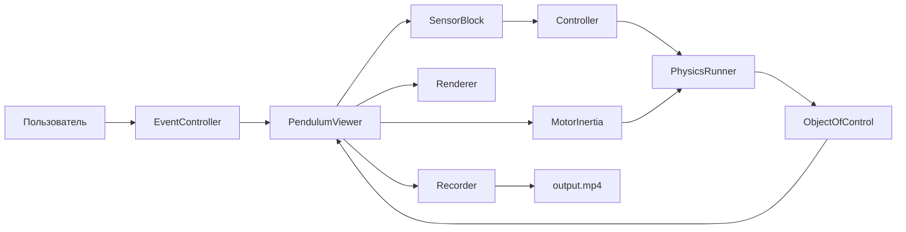

# Пакет GUI (черновик)

Краткое описание

Пакет GUI предоставляет простую обёртку для визуализации и управления симуляцией из подпакета [`packages/simulation/CO`](packages/simulation/CO/controller.py:1). Основные компоненты расположены в модулях:

- [`packages/simulation/GUI/gui.py`](packages/simulation/GUI/gui.py:1) — главный входной модуль для запуска окна и инициализации подсистем.
- [`packages/simulation/GUI/renderer.py`](packages/simulation/GUI/renderer.py:1) — визуализация сцен и объектов.
- [`packages/simulation/GUI/input_handling.py`](packages/simulation/GUI/input_handling.py:1) — обработка ввода пользователя.
- [`packages/simulation/GUI/physics_runner.py`](packages/simulation/GUI/physics_runner.py:1) — цикл физики / шаг симуляции.
- [`packages/simulation/GUI/event_controller.py`](packages/simulation/GUI/event_controller.py:1) — управление событиями и взаимодействие между подсистемами.
- Дополнительно: [`packages/simulation/GUI/dialogs.py`](packages/simulation/GUI/dialogs.py:1), [`packages/simulation/GUI/recorder.py`](packages/simulation/GUI/recorder.py:1), [`packages/simulation/GUI/draw.py`](packages/simulation/GUI/draw.py:1), [`packages/simulation/GUI/constants.py`](packages/simulation/GUI/constants.py:1).

Требования

- Python 3.8+ (проверьте [`packages/simulation/GUI/pyproject.toml`](packages/simulation/GUI/pyproject.toml:1)).
- Зависимости проекта указаны в корневом `pyproject.toml` и/или в [`packages/simulation/GUI/pyproject.toml`](packages/simulation/GUI/pyproject.toml:1).
- Рекомендуется запускать в виртуальном окружении (venv, poetry, pipenv).

Установка

1. Клонируйте репозиторий или перейдите в корневую папку проекта (директория содержит `main.py`).
2. Создайте и активируйте виртуальное окружение.
3. Установите зависимости проекта. Пример с pip (из корня проекта):

   pip install -e .

   или, если используете poetry:

   poetry install

Быстрый старт — базовый пример запуска GUI

Пример использования из корня проекта:

1. Убедитесь, что вы находитесь в каталоге проекта (где лежит `main.py`).
2. Запустите основной скрипт, который инициализирует симуляцию + GUI. Пример (если проект запускается через `main.py`):

   python main.py

Если в вашем проекте есть прямой запуск GUI через модуль, можно запустить напрямую:

   python -m packages.simulation.GUI.gui

Пример кода (псевдо):

- В [`packages/simulation/GUI/gui.py`](packages/simulation/GUI/gui.py:1) ожидается функция/класс, создающий окно и стартующий цикл:

   from packages.simulation.CO.controller import Controller  # пример
   from packages.simulation.GUI.gui import GUI  # предположение

   controller = Controller(...)
   gui = GUI(controller)
   gui.run()

Полезные проверки при запуске

- Проверьте логи в терминале на наличие ошибок импорта модулей.
- Если GUI не открывается, убедитесь, что зависимости для графики (например, pygame, pyglet и т.п.) установлены — посмотреть в [`packages/simulation/GUI/pyproject.toml`](packages/simulation/GUI/pyproject.toml:1).

Дальнейшие итерации

Этот файл — первый черновик. В следующих итерациях можно добавить:

- Конкретные команды установки зависимостей (список из `pyproject.toml`).
- Точный пример кода и список параметров конструктора GUI/Controller (по содержимому файлов).
- Раздел «Отладка и логирование» и FAQ.

Статус задачи

- Черновик README подготовлен и добавлен в план работ. Следующий шаг — внести изменения по вашему фидбеку и при необходимости раскрыть API модулей с примерами.

Конец черновика README.

Архитектура и логика модулей (акцент на [`packages/simulation/GUI/gui.py`](packages/simulation/GUI/gui.py:46))

Ниже кратко описана внутренняя логика `PendulumViewer` и как он связывает остальные модули пакета.

- Инициализация (конструктор)
  - Класс `PendulumViewer` определён в [`packages/simulation/GUI/gui.py`](packages/simulation/GUI/gui.py:46). При создании он сохраняет ссылки на:
    - объект физики `plant` (тип [`packages/simulation/CO/ObjectOfControl`](packages/simulation/CO/controller.py:1)),
    - конфигурацию сенсора `sensor_config` и создаёт `SensorBlock`,
    - объект помех `NoiseForce`,
    - опциональный `Controller` (если `None` — используется ручное управление через клавиши),
    - целевое состояние `target_state` для вычисления ошибки управления.
  - Инициализируются подсистемы GUI:
    - `EventController` — обработка событий и действий пользователя (`poll()` возвращает словарь действий), см. [`packages/simulation/GUI/event_controller.py`](packages/simulation/GUI/event_controller.py:1).
    - `PhysicsRunner` — обёртка над пошаговым интегратором физики, используется для выполнения нескольких мелких шагов за один такт управления, см. [`packages/simulation/GUI/physics_runner.py`](packages/simulation/GUI/physics_runner.py:1).
    - `Renderer` — ответственный за отрисовку сцены и HUD; получает экран и шрифт, вызывается в методе `_draw`, см. [`packages/simulation/GUI/renderer.py`](packages/simulation/GUI/renderer.py:1).
    - `Recorder` / `recorder_obj` — сборка кадров и компиляция видео, см. [`packages/simulation/GUI/recorder_obj.py`](packages/simulation/GUI/recorder_obj.py:1) и [`packages/simulation/GUI/recorder.py`](packages/simulation/GUI/recorder.py:1).

- Главный цикл (`use()`)
  - Запуск через `PendulumViewer.use()` в [`packages/simulation/GUI/gui.py`](packages/simulation/GUI/gui.py:114). Метод блокирует и выполняет:
    1. Предложение начать запись через диалог `ask_recording` ([`packages/simulation/GUI/dialogs.py`](packages/simulation/GUI/dialogs.py:1)).
    2. Цикл обработки событий: получает `actions = self._event_controller.poll()`; если в `actions` содержится `running=False` — цикл завершается.
    3. Обработка переключения записи (`toggle_record`) и сохранения кадров через `pygame.image.save` и последующая компиляция `compile_video`.
    4. Чтение состояния клавиш (ESC/Q для выхода, SPACE для сброса, стрелки для ручного управления).
    5. Управляющий таймер: аккумулируется время `control_acc_ms` и, когда накоплено >= control interval, выполняется один или несколько шагов управления и соответствующее число шагов физики:
       - Для каждого шага управления: получить телеметрию через `SensorBlock.get_telemetry`, вычислить управляющее усилие вызовом `Controller.compute_control` (если контроллера нет — используется `MotorInertia` и ручной ввод).
       - Выполнить мелкие шаги физики через `PhysicsRunner.step(...)` для точности интеграции.
    6. Между управляющими тактами продолжается только визуализация (чтобы GUI оставался отзывчивым при низкой частоте управления).

- Связь подсистем при шаге симуляции
  - Контроллер получает измерения от `SensorBlock` и целевое состояние `self._target` и возвращает усилие `F`.
  - Усилие `F` используется двумя путями:
    - для интеграции физики в `PhysicsRunner` (несколько мелких шагов за такт управления),
    - для визуализации стрелки силы и HUD в `Renderer`/`_draw`.
  - Между управляющими шагами `PendulumViewer` дополнительно вызывает `self._plant.update_physics` в цикле SUBTICKS (защита от рассинхронизации визуализации и физики).

- Запись и компиляция видео
  - При включённой записи кадры сохраняются в `self._record_dir` с именами `frame_XXXXXX.png` (вызов `pygame.image.save`).
  - После остановки записи или завершения симуляции вызывается `compile_video` из `recorder.py` для сборки mp4 (в коде предусмотрлена попытка вызвать ffmpeg).

- Сброс и терминализация
  - Кнопка пробел вызывает `_reset()`, которая возвращает `plant` и контроллер в начальное состояние (см. [`packages/simulation/GUI/gui.py`](packages/simulation/GUI/gui.py:348)).
  - Опциональная `terminate_condition` проверяется после каждого шага физики; при достижении условия симуляция помечается как завершённая и останавливается подача управления.

Рекомендации по модификации и отладке

- Если вы меняете частоту управления или шаг интеграции, обратите внимание на константы в [`packages/simulation/GUI/constants.py`](packages/simulation/GUI/constants.py:1): `PHYSICS_DT`, `SUBTICKS`, `FPS` и т.д.
- Для добавления новых действий (кнопок/меню) расширьте [`EventController.poll()`](packages/simulation/GUI/event_controller.py:1) и обрабатывайте их в основном цикле `use()`.
- Для изменения отрисовки переместите соответствующую логику в [`renderer.py`](packages/simulation/GUI/renderer.py:1) — текущий `PendulumViewer._draw` содержит часть отрисовки напрямую; можно сократить `_draw` и делегировать больше задач `Renderer`.

Следующие шаги (итеративно)

- По вашему подтверждению: разобрать и документировать API `Renderer`, `EventController`, `PhysicsRunner`, `Recorder` и `SensorBlock` отдельными короткими секциями.
- Добавить диаграмму потоков (Mermaid) для визуализации взаимодействий подсистем.

Mermaid-диаграмма: поток данных и взаимодействие подсистем

Примечания к диаграмме

- Стрелки показывают направление потока данных и команд. `PendulumViewer` выступает координирующим модулем: он получает события из `EventController`, запрашивает телеметрию у `SensorBlock`, вызывает `Controller` для получения усилия и делегирует интеграцию физики `PhysicsRunner` / напрямую `Plant`.
- `Recorder` сохраняет кадры, а затем при необходимости вызывает сборку видео (ffmpeg).
- Для ручного управления используется `MotorInertia`, чтобы сгладить мгновенные изменения силы при удержании клавиш.

Если хотите, перенесу часть визуализации из [`packages/simulation/GUI/gui.py`](packages/simulation/GUI/gui.py:389) в [`packages/simulation/GUI/renderer.py`](packages/simulation/GUI/renderer.py:1) и обновлю диаграмму соответствующим образом.

